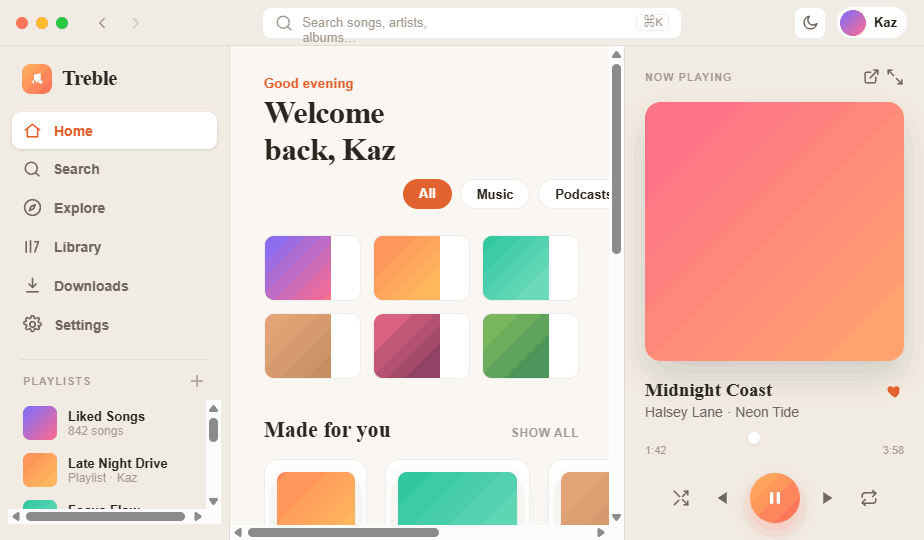
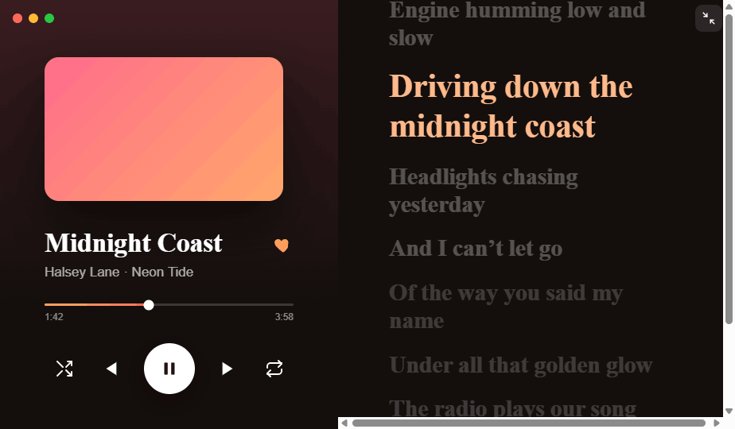
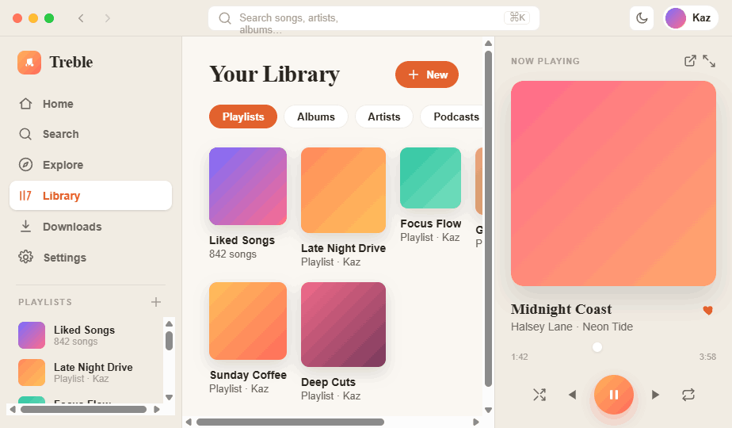
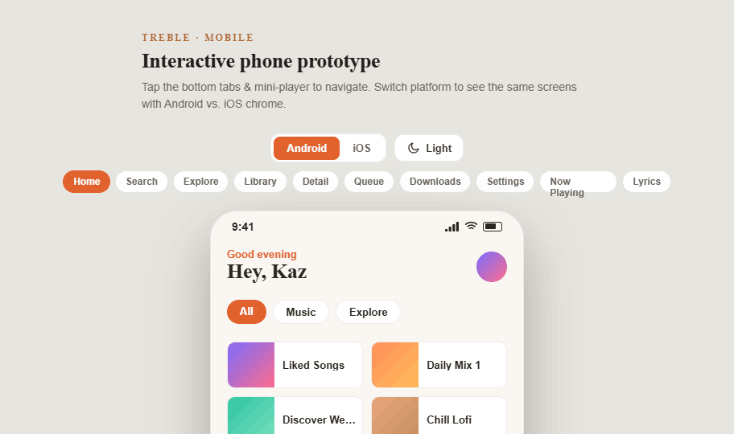

<div align="center">

# 🎵 Treble

### *A warm little music client for people who still make playlists.*

**Win32 · Linux · Android — one warm amber UI, your whole library, everywhere.**

[](LICENSE)
[](https://tauri.app)
[](https://www.rust-lang.org/)
[](ROADMAP.md)

*Treble (n.) — the high notes. Also: a treble-maker.* 🎶

</div>

---

## What is this?

Treble is a cross-platform music client with a soul: a warm amber/coral interface (light **and** dark),
a signature "Studio" layout where the now-playing panel lives docked on the right instead of a sad little
bar at the bottom, and a split-screen lyrics view that actually feels good to read.

Under that pretty face, Treble pulls its catalog from **YouTube Music** (via a fully native Rust
[InnerTube](https://codeberg.org/ThetaDev/rustypipe) client — so it runs the *same engine* on your laptop
**and** your phone), downloads tracks for real offline listening, fetches time-synced lyrics, and can
**import a Spotify playlist straight from your clipboard**.

> **We did not build the hard parts.** Treble is a nice coat of paint on a *mountain* of work by other
> people — the folks who reverse-engineered YouTube's API, wrote the downloaders, built the lyrics
> databases, and made the cross-platform app framework. See **[CREDITS](CREDITS.md)**. Go star their repos.

## The pitch, in pictures

| | |
|---|---|
|  |  |
| **Home** — warm, time-aware, yours | **Now Playing** — the lyrics-split signature view |
|  |  |
| **Library** — playlists, albums, artists, podcasts | **Android** — same app, in your pocket |

## ✨ Features

- 🎧 **Real playback & full downloads** — stream from YouTube Music or save tracks for offline (`yt-dlp` + `ffmpeg` on desktop, native Rust on mobile).
- 📋 **Spotify playlist import** — copy a playlist in Spotify (`Ctrl+A → Ctrl+C` on the track list), hit **Import** in Treble, and we parse it, match every track on YouTube Music, and save it as a real, playable Treble playlist.
- 🎤 **Time-synced lyrics** — pulled from [LrcLib](https://lrclib.net), highlighted line-by-line, in a pop-out window or the full-screen split view.
- 📡 **LAN sync, no cloud, no account** — your phone and your desktop find each other on the same Wi-Fi and sync your library directly. No server to run, nothing leaves your network.
- 🌗 **Light + dark, 4 accents** — Amber, Coral, Rose, Gold. Instant theme swap, no reload.
- 🪟 **Pop-out mini-player & lyrics windows** — real always-on-top windows on desktop.
- 📱 **Actually cross-platform** — Win32, Ubuntu/Linux, and a **sideloadable Android APK** from one codebase.

## 🚀 Quick start

```bash
git clone https://github.com/sp00nznet/treble
cd treble/app
npm install

npm run dev          # fast UI iteration in a browser tab
npm run desktop      # the real frameless desktop app (Tauri)
npm run desktop:build  # produce a win32 / linux bundle
```

**Prerequisites:** Node 18+, the [Rust toolchain](https://rustup.rs), and the
[Tauri 2 system deps](https://tauri.app/start/prerequisites/) for your OS. `ffmpeg` is bundled by
`scripts/fetch-tools` (see [docs/BUILDING.md](docs/BUILDING.md)).

Building the Android APK? See **[docs/BUILDING.md → Android](docs/BUILDING.md#android)** — you'll need
the Android SDK/NDK once, then `npm run android:build` spits out a sideloadable APK.

## 🧱 How it's built

```
treble/
├── app/                     the application
│   ├── src/                 React + TypeScript frontend (the warm UI)
│   │   ├── lib/api.ts        ← the bridge: typed calls into the Rust core (mock fallback in browser)
│   │   └── screens/          home · search · library · detail · downloads · settings · queue
│   └── src-tauri/           the Rust core — runs identically on desktop + Android
│       └── src/core/        catalog · downloads · lyrics · library · spotify_import · sync
├── design/                  the original design handoff (the source of truth for the look)
├── CREDITS.md               🙏 everyone whose work this stands on
├── ARCHITECTURE.md          how the pieces fit together
└── ROADMAP.md               what's done, what's next
```

One **Rust core**, three platforms. The catalog/search/stream engine is native Rust
([`rustypipe`](https://codeberg.org/ThetaDev/rustypipe)) precisely so the *exact same code* powers the
desktop app and the Android APK — no Python runtime required on your phone. Full story in
**[ARCHITECTURE.md](ARCHITECTURE.md)**.

## 🗺️ Status

Treble is an **early but real prototype**. The entire UI is built and the architecture is in place; the
backend is being wired screen by screen. Track it in **[ROADMAP.md](ROADMAP.md)**.

## ⚖️ A note on being a good citizen

Treble is a personal, educational, open-source music client in the long tradition of
[NewPipe](https://newpipe.net), [InnerTune](https://github.com/z-huang/InnerTune), and
[yt-dlp](https://github.com/yt-dlp/yt-dlp). Use it for your own music, respect artists, respect the
terms of service of the platforms you connect to, and please **buy merch / concert tickets / records**
from the people who make the music you love. Don't be weird with it.

## 🤝 Contributing

This is a hobby project with big dreams. Issues, ideas, and PRs welcome — start with
[ROADMAP.md](ROADMAP.md) to see where the gaps are. Be kind, credit upstream, keep it warm.

## 📜 License

[GPL-3.0](LICENSE) — same spirit as the projects Treble is built on. If you build on Treble, keep it open.

<div align="center">

*Made with 🧡 and an unreasonable number of CSS custom properties.*

</div>
